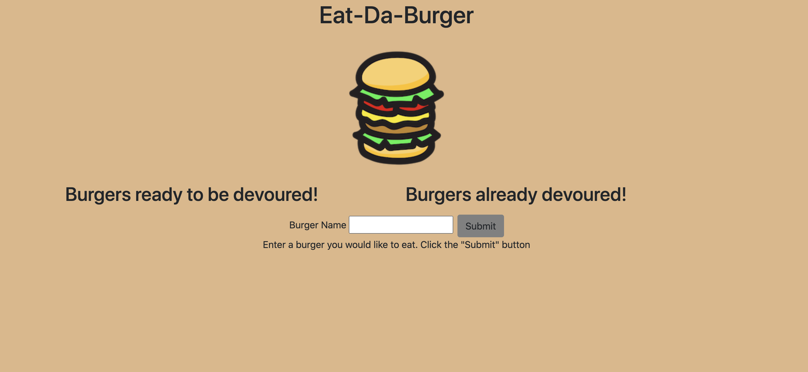
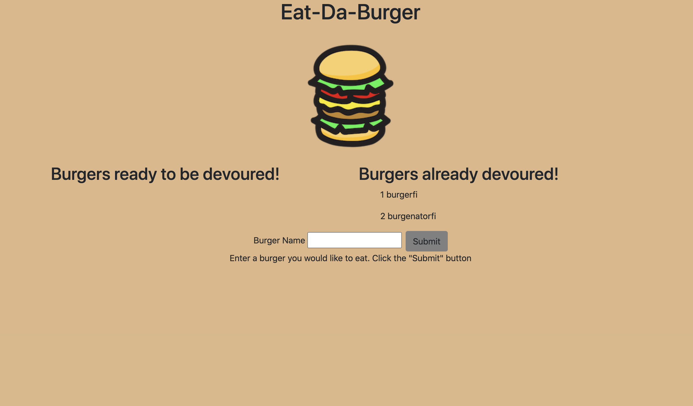

# burgerEater

# Human Resources Tool

## Description
This is an application that can be used to create, view and update a database with employees, departments, roles and managers.

## Table of Contents 
* [Installation](#installation)
* [Usage](#usage)
* [Credits](#credits)
* [MIT License](#MIT-License)
* [Contributing](#Contributing)

## Installation
For you to be able to use this app locally, you will have to clone this repository to your local machine.  Once you do that and open the folder containing all the files, you will see a schema file containing the database schema for you to add to your MySql. Once you do that, you can add some dafault "ready to eat burgers" inside the seeds file. Inside the server.js file, you will need to update the password to that of your MySql instance. Once that is done, all you have to do is go to your terminal and access the application, then run "npm install" so all the dependencies needed are installed in your local machine. Once this is done, all you have to do is acces the folder where the server.js file is and run "node server.js" and click on the localhost link in your terminal. Enjoy!
Otherwise, you can also go to the deployed app if you follow this link:

[Deployed Burger Eater](https://intelligent-monsieur-61037.herokuapp.com/)

## Usage 
You can use this app to store, view and modify your burgers database.

## Test Instructions

No tests at the moment.

## MIT License

This project is licensed under the MIT license.

## Contributing

No collaborators at this time but you are more than welcome to improve it!

## Questions

If you have any questions pleae direct them to my email address: diegocordoba87@gmail.com or contact me via GitHub here: 
https://github.com/diegocordoba87
 

